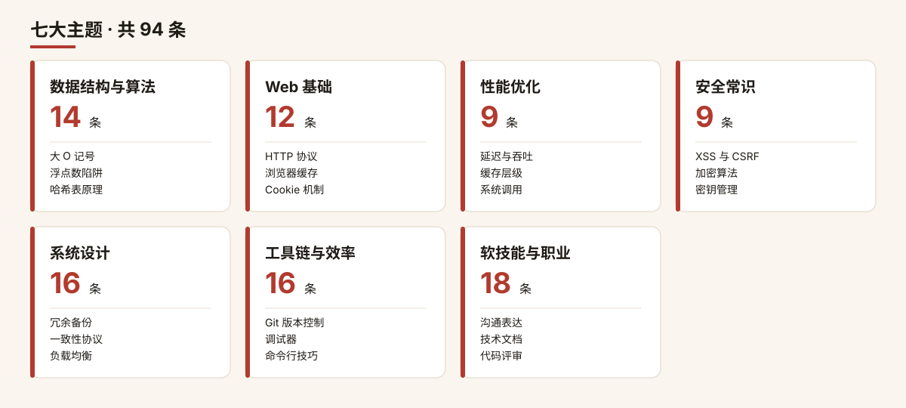
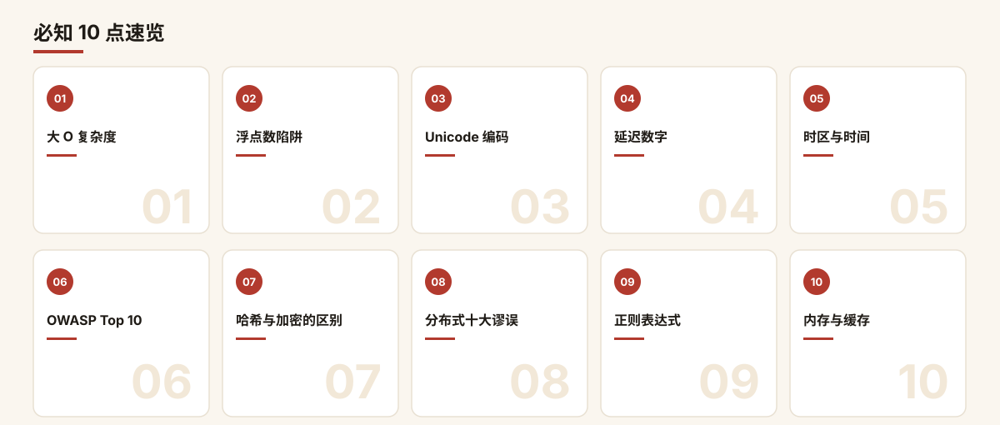

  

<h1 align="center">every-programmer-should-know-zh</h1>

> **10 万 star 的「程序员必知清单」，终于有中文解读版了。**
>
> 精选 GitHub 顶流仓库 [every-programmer-should-know](https://github.com/mtdvio/every-programmer-should-know)（mtdvio，CC-BY-4.0，10.1 万 star）中的 **94 个知识点**，逐条配上**中文解读 · 一句话总结 · 必知理由**——不读英文长文，几分钟建立一条知识直觉。

---

⭐ 如果对你有帮助，点个 Star 支持中文开源

## ✨ 为什么值得收藏

- **94 条干货**，覆盖算法、编码、性能、安全、架构、工具链、职业成长 7 大主题，一条一个知识点；
- **每条约 30 秒读完**：中文解读讲清「是什么」，一句话总结直接可收藏，必知理由告诉你「为什么逃不掉」；
- **英文资料友好入口**：每条附原仓库推荐阅读链接，想深挖随时可以顺藤摸瓜；
- **零废话排版**：暖色系卡片配图，手机上也能舒服地刷完一整类。

---

## 🗂 主题总览

| 主题 | 条数 | 代表知识点 |
| --- | --- | --- |
| 1. 数据结构与算法 | 14 | 大 O 复杂度 · 算法可视化 · 浮点数陷阱 |
| 2. Web 基础 | 12 | 字符编码 · 正则表达式 · SEO 常识 |
| 3. 性能优化 | 9 | 延迟数字 · 内存模型 · 时区与时间 |
| 4. 安全常识 | 9 | OWASP · 密码学 · 注入与越权 |
| 5. 系统设计 | 16 | 分布式 · DDIA · 架构演进 |
| 6. 工具链与效率 | 16 | Git · TDD · 开源许可证 |
| 7. 软技能与职业 | 18 | 面试谈薪 · 远程工作 · 沟通艺术 |
| **合计** | **94** | 7 大主题 |

  

---

## 🚀 必知 10 点速览

来不及全刷？先看这 10 条「程序员共同语言」：复杂度、浮点数、编码、延迟、时区、安全、哈希、分布式、正则、内存——和任何人聊技术，都绕不开它们。

  

---

## 1. 数据结构与算法（14 条）

> 算法与数据结构是程序员的通用语言：先懂复杂度，再懂容器，最后才是花式技巧。

### 大 O 复杂度速查表（Big O Cheatsheet）

> 中文解读：用 O(1)、O(log n)、O(n)、O(n log n)、O(n²) 描述算法耗时随数据规模增长的趋势，是程序员比较算法优劣的通用语言。查表比背表更快，重点是建立「量级直觉」：100 万个元素里，O(n²) 是 O(n log n) 的几万倍。

- **一句话总结**：先估量级再抠常数，O(n log n) 永远优于对 O(n²) 的「微优化」。
- **必知理由**：面试写算法必被问、日常选型（排序、查找、索引）天天用，不懂 Big O 就没法理性比较两段代码谁更快。
- **推荐阅读**：[Big O Cheatsheet](http://bigocheatsheet.com/)

### 《计算机科学精要》（Computer Science Distilled）

> 中文解读：一本把计算机科学核心概念压缩成薄薄一册的入门书，用最少的数学讲清算法、数据结构、机器学习与计算理论的全貌。它不追求严谨推导，而是帮你在最短时间内建立 CS 的「地图」。

- **一句话总结**：厚教材读不动？先拿这本薄书把 CS 全景地图装进脑子。
- **必知理由**：面试常被跨领域追问，有张全景图才不会被问到知识盲区；日常选型时能快速定位「这个问题属于哪一类」，少走弯路。
- **推荐阅读**：[Computer Science Distilled](https://www.goodreads.com/book/show/34189798-computer-science-distilled)

### 《算法图解》（Grokking Algorithms）

> 中文解读：用大量手绘插图把二分查找、排序、递归、动态规划等核心算法画给你看，几乎不堆公式。它把「为什么这样想」讲得比「代码怎么写」更透，是零基础入门算法的第一把梯子。

- **一句话总结**：怕算法书像天书？这本全是图，躺着也能把核心算法看懂。
- **必知理由**：入门阶段最怕被数学劝退，这本书帮你跨过心理门槛；工作三五年想补算法底子时，它比厚教材更容易啃完一遍。
- **推荐阅读**：[Grokking Algorithms](https://www.goodreads.com/book/show/22847284-grokking-algorithms-an-illustrated-guide-for-programmers-and-other-curio)

### 《算法导论》（Introduction to Algorithms，CLRS）

> 中文解读：算法领域的「红宝书」，系统覆盖排序、图论、动态规划、NP 完全性等内容，是大学科班的标准教材。它严谨而厚，不求读完，而是作为案头参考书，遇到具体问题时再翻对应章节。

- **一句话总结**：算法界的字典，不用从头背，但遇到难题一定得会查它。
- **必知理由**：大厂面试高频考点几乎都能在里面找到严格推导，懂原理才能举一反三；和面试官聊复杂度、聊边界条件时有底气，而不是只会背模板。
- **推荐阅读**：[Introduction to Algorithms](https://www.goodreads.com/book/show/108986.Introduction_to_Algorithms)

### 算法可视化（Algorithms Visualization）

> 中文解读：一个把排序、树、图、哈希等数据结构和算法「跑给你看」的交互页面，点一下就能看到元素怎么移动、指针怎么走。它把抽象的动态过程变成肉眼可见的动画。

- **一句话总结**：看不懂算法在干嘛？让它动起来，一步一步演给你看。
- **必知理由**：很多人背得出代码却想不明白过程，可视化能帮你建立「动态直觉」；面试手写算法卡壳时，脑子里能放映这段动画，思路就顺了。
- **推荐阅读**：[Algorithms Visualization](https://www.cs.usfca.edu/~galles/visualization/Algorithms.html)

### 竞赛算法大全（cp-algorithms）

> 中文解读：由竞赛社区维护的算法速查手册，覆盖数论、组合数学、字符串、图论、动态规划等进阶主题，每个条目都附核心原理和可直接套用的代码。它偏实战、偏竞赛，是查漏补缺的进阶工具箱。

- **一句话总结**：竞赛党的算法 Wiki，遇到冷门考点直接翻，原理代码一步到位。
- **必知理由**：工作中偶尔会碰到区间、字符串、数论这类「教科书不细讲但真要用」的问题，这里有现成解法；准备笔试时扫一遍，能补齐很多边界技巧。
- **推荐阅读**：[cp-algorithms](https://cp-algorithms.com/)

### 《Hello 算法》（Hello 算法）

> 中文解读：一本开源、图文并茂的算法教程，从数组、链表讲到树、堆、图，每种结构都配动画和多语言代码示例。它定位「能跑起来的入门书」，边读边动手敲，门槛比传统教材低很多。

- **一句话总结**：开源免费、动画拉满，从零手搓数据结构的最佳实战读物。
- **必知理由**：看一遍不如敲一遍，它带你把每种结构真正实现出来，理解才扎实；新手容易只背调库 API，这本帮你搞清楚「容器内部到底怎么存数据」。
- **推荐阅读**：[Hello 算法](https://www.hello-algo.com/en/chapter_preface/about_the_book/)

### UC Berkeley 数据结构课（Data Structures Course）

> 中文解读：加州伯克利的一门公开数据结构课程主页，含讲义、作业、项目和可视化作业，强调「自己动手实现一个数据结构库」。它不是看课，而是逼着你把链表、树、哈希表真正写一遍。

- **一句话总结**：别光听课，跟完这门课把自己的标准库实现一遍。
- **必知理由**：课程项目式学习比看书记得牢，面试被问「HashMap 底层是什么」能从实现细节答起；跟过一遍作业，对内存和指针的理解会上一个台阶。
- **推荐阅读**：[Data Structures Course](https://sp19.datastructur.es/)

### EDX 数据结构基础（Foundations of Data Structures）

> 中文解读：印度理工孟买分校在 EDX 上的公开课，系统讲解数组、栈、队列、树、图等基础结构的设计与分析，带作业和测验。它适合想跟着大学节奏、按部就班补科班底子的人。

- **一句话总结**：想补「科班感」？跟着名校公开课从最基础的容器一步步学。
- **必知理由**：自学容易东一榔头西一棒子，一门结构完整的课能帮你补齐系统性；有测验和作业约束，学完确实能对照标准衡量自己到底会没会。
- **推荐阅读**：[Foundations of Data Structures](https://www.edx.org/course/foundations-data-structures-iitbombayx-cs213-1x-0)

### Coursera 数据结构课（Data Structures）

> 中文解读：加州大学圣迭戈分校在 Coursera 上的数据结构专项课，与算法课配套，从链表一路讲到二叉搜索树、哈希表和堆。它偏实战作业，强调用所学结构去解决具体编程题。

- **一句话总结**：和算法课连着上，学一个结构立刻拿题目练手。
- **必知理由**：很多人「看懂了但不会写」，这门课的编程作业专治这个问题；按它的节奏刷完，面试手写常见结构基本不慌。
- **推荐阅读**：[Data Structures](https://www.coursera.org/learn/data-structures)

### 计算机科学数学基础（Mathematics for Computer Science）

> 中文解读：MIT 的一本开放讲义，用证明、归纳、组合计数、图论等内容讲清 CS 背后的数学骨架。它把「为什么算法成立」从数学上严格地讲一遍，是从「会用」到「懂原理」的关键一跃。

- **一句话总结**：算法背后那套「为什么」，答案都藏在这本数学讲义里。
- **必知理由**：只背算法不懂证明，换个变体就不会推；做系统、做研究、读论文时，数学基础决定了你能走多远。
- **推荐阅读**：[Mathematics for Computer Science](https://people.csail.mit.edu/meyer/mcs.pdf)

### 《如何计数》（How to Count）

> 中文解读：一本讲组合数学的小书，从加法原理、乘法原理一步步推到排列、组合、鸽巢原理与概率初步。它解决的是「面对一堆可能情况，怎么不重不漏地算清楚」这个程序员天天会遇到的问题。

- **一句话总结**：算不清「有多少种可能」？这本把组合计数讲到你会为止。
- **必知理由**：分析复杂度、设计测试用例、评估概率场景时全靠计数直觉；不懂组合计数，估性能、做容量规划时拍脑袋，很容易算错数量级。
- **推荐阅读**：[How to Count](https://www.goodreads.com/book/show/12093869-how-to-count)

### 浮点数指南（Floating Point Guide）

> 中文解读：一篇面向实战的浮点数科普，用例子讲清楚 0.1 + 0.2 为什么不等于 0.3、精度为什么会丢、什么时候该用小数或整型。它不堆 IEEE754 公式，专讲「你会踩的坑」。

- **一句话总结**：0.1+0.2≠0.3 不是 bug，是浮点数的天性，这篇教你绕着走。
- **必知理由**：做金融、统计、图形时几乎必踩浮点精度坑，不知道就会出现「对不上账」的诡异 bug；懂得比较时用误差容限、存钱用定点，能少背很多锅。
- **推荐阅读**：[Floating Point Guide](http://floating-point-gui.de/)

### 浮点算术详解（What Every Computer Scientist Should Know About Floating-Point Arithmetic）

> 中文解读：David Goldberg 的经典论文，系统讲透 IEEE754 浮点数的表示、舍入误差、消去与精度损失的来龙去脉。它是上面那篇科普的「硬核源头」，适合想把浮点问题彻底搞明白的人。

- **一句话总结**：浮点领域的「圣经」，把 IEEE754 的坑从原理上一次性讲透。
- **必知理由**：当浮点 bug 排查到根因层，就需要这篇论文级别的理解；写数值计算、做库、解释诡异误差时，它是公认权威引用，读完不再凭感觉调精度。
- **推荐阅读**：[What Every Computer Scientist Should Know About Floating-Point Arithmetic](https://docs.oracle.com/cd/E19957-01/806-3568/ncg_goldberg.html)

## 2. Web 基础（12 条）

> Web 是大多数程序员的日常战场：字符编码、正则、SEO、可用性……这些「基础课」决定你写的东西别人能不能用、能不能看懂。

### 字符编码与 Unicode（Unicode and Character Sets）

> 中文解读：所有文本在计算机里都是一串数字，Unicode 给每个字符一个统一编号（码点），UTF-8/UTF-16 决定这些编号怎么存。字符集没搞对，「乱码」就会像幽灵一样缠着你。

- **一句话总结**：写代码时永远显式声明编码，默认 UTF-8，绝不要把「编码」和「字符集」混为一谈。
- **必知理由**：乱码问题排查成本极高；数据库、API、文件、数据库连接串四处都可能踩坑，一次搞懂终身受益。
- **推荐阅读**：[The Absolute Minimum Every Software Developer Absolutely, Positively Must Know About Unicode and Character Sets](https://www.joelonsoftware.com/articles/Unicode.html)

### ASCII 编码（ASCII，视频）

> 中文解读：ASCII 是最早的字符编码标准，用 7 位二进制表示 128 个英文字母、数字和控制符。它是所有现代编码的「地基」，看懂它才能明白后来的 UTF-8 为什么能向下兼容。

- **一句话总结**：ASCII 是英文世界的原始密码本，128 个字符奠定了一切编码的起点。
- **必知理由**：面试常被追问「UTF-8 为什么兼容 ASCII」；不懂它，遇到字节取值范围、0x20 空格这类底层问题就会发懵。
- **推荐阅读**：[ASCII (video)](https://www.youtube.com/watch?v=B1Sf1IhA0j4)

### UTF-8 编码（UTF-8，视频）

> 中文解读：UTF-8 是变长编码，按字符复杂度用 1~4 个字节存储，英文字符只占 1 字节且与 ASCII 完全一致。它是今天互联网的事实标准，也是省存储、防乱码的关键。

- **一句话总结**：UTF-8 用「长短不一」的字节把全世界文字装进同一套编码，又省空间又兼容老系统。
- **必知理由**：几乎所有接口、文件、前端传输都默认 UTF-8；搞不清变长规则，算字符串长度、处理截断和 emoji 时必踩坑。
- **推荐阅读**：[UTF-8 (video)](https://www.youtube.com/watch?v=vLBtrd9Ar28)

### Unicode 区域数据（Unicode Common Locale Data Repository，CLDR）

> 中文解读：CLDR 是 Unicode 维护的「区域语言数据库」，规定了不同国家地区的日期、货币、排序和翻译习惯。做国际化（i18n）时，它就是你的标准答案库。

- **一句话总结**：想让产品在全球都「看起来对」，就别自己硬编码格式，去查 CLDR。
- **必知理由**：自己拼日期、货币格式迟早翻车；知道 CLDR 的存在，做国际化时直接对接现成数据，能少造半年轮子。
- **推荐阅读**：[Unicode Common Locale Data Repository (CLDR)](http://cldr.unicode.org/)

### 同形字攻击（Homoglyphs）

> 中文解读：同形字指长得几乎一样、实则不同的字符（如用西里尔字母 а 冒充英文 a）。攻击者靠它伪造域名、仿冒账号，肉眼几乎分不出来。

- **一句话总结**：「长得像」不等于「是同一个」，同形字钓鱼就是靠字形撞脸骗你点链接。
- **必知理由**：做安全相关功能（注册名校验、链接展示）时必须能识别这种攻击；日常自己也得有这根弦，别被高仿域名钓了。
- **推荐阅读**：[Homoglyph](https://github.com/codebox/homoglyph/)

### 正则表达式快速入门（Learn regex the easy way）

> 中文解读：这份教程从最基础的符号讲起，由浅入深覆盖匹配、分组、量词等核心语法。正则是处理文本的「瑞士军刀」，入门门槛高，但学会后效率翻倍。

- **一句话总结**：正则看着像天书，其实按符号一个个啃，两周就能脱胎换骨。
- **必知理由**：日志清洗、表单校验、文本提取全靠它；面试手写正则是高频考点，不会就眼睁睁看着机会溜走。
- **推荐阅读**：[Learn regex the easy way](https://github.com/ziishaned/learn-regex)

### 正则表达式游戏（Regex Crossword）

> 中文解读：这是一个把正则当「填字游戏」来玩的练习站，每关都要求你写出能匹配指定格子、同时排除另一批格子的表达式，玩着玩着就把正则练熟了。

- **一句话总结**：与其背语法，不如去网站上把正则当游戏刷关，体感式进步最快。
- **必知理由**：正则「看得懂」和「写得出」是两回事；这种交互式练习专治眼高手低，写复杂规则时才不会脑子卡壳。
- **推荐阅读**：[Regex Crossword](https://regexcrossword.com/)

### SEO 常识（What Every Programmer Should Know About SEO）

> 中文解读：SEO 不是玄学，而是让搜索引擎能读懂、愿意推荐你页面的一系列工程细节：语义化标签、加载性能、结构化数据。程序员懂一点，才能和产品、运营说同一种语言。

- **一句话总结**：别把 SEO 全丢给运营，页面结构和性能写对，自然流量就已经赢了一半。
- **必知理由**：很多「上线后没人来」的问题其实是前端埋的坑（缺 title、渲染慢、链接爬不到）；懂点 SEO 既能避免背锅，也能主动优化。
- **推荐阅读**：[What Every Programmer Should Know About SEO](https://katemats.com/blog/what-every-programmer-should-know-about-seo)

### Web 可用性（Don't Make Me Think）

> 中文解读：这本书的核心就一句话——用户用你的网站时不该需要动脑子。它讲导航、布局、文字如何做到「一目了然」，是产品和前端的通用入门圣经。

- **一句话总结**：好的网页是「不用想就能用」，让用户每一次点击都不纠结。
- **必知理由**：功能再强，用户找不到按钮也是白搭；懂可用性原则，code review 时能一眼看出交互设计的硬伤。
- **推荐阅读**：[Don't Make Me Think, Revisited](https://www.goodreads.com/book/show/18197267-don-t-make-me-think-revisited)

### JavaScript 工作原理（How JavaScript works 系列：引擎/内存/事件循环）

> 中文解读：这个系列拆解了 JS 引擎如何编译执行代码、内存如何管理回收、事件循环如何调度异步任务。理解这些，「为什么这段异步代码的输出是这个顺序」就不再靠猜。

- **一句话总结**：搞懂引擎、调用栈和事件循环，JS 的异步行为从此有迹可循。
- **必知理由**：事件循环、闭包、内存泄漏是面试必考；不知道底层机制，排查 setTimeout / Promise 顺序问题只能靠玄学调试。
- **推荐阅读**：[How JavaScript works (Part 1)](https://medium.com/sessionstack-blog/how-does-javascript-actually-work-part-1-b0bacc073cf)

### 设计原则（Inventing on Principle，视频）

> 中文解读：这是 Bret Victor 的经典演讲，核心观点是「开发者应当能即时看到自己代码的后果，并围绕这条原则重塑工具与创作方式」。它逼你思考：你的工具链是不是在拖慢你的思考。

- **一句话总结**：好工具应让想法「即时可见」，别让抽象和等待掐断你的灵感。
- **必知理由**：它不教具体语法，而是塑造你对「开发体验」和「反馈闭环」的品味；看过的人往往会重新审视自己写代码、做工具的方式。
- **推荐阅读**：[Inventing on Principle (video)](https://vimeo.com/906418692)

### 正则资源库（RegexHQ）

> 中文解读：RegexHQ 是一个收集各类正则实现、教程和在线测试工具的索引站。不同语言的正则引擎差异不小，遇到具体场景先查这里，往往比自己硬写更靠谱。

- **一句话总结**：正则别闭门造车，先去 RegexHQ 看看现成方案和各语言差异。
- **必知理由**：跨语言写正则时，引擎差异（贪婪匹配、lookbehind）经常坑人；有个靠谱资源库在手，能少踩很多「在 A 语言能跑、到 B 就崩」的坑。
- **推荐阅读**：[RegexHQ](https://github.com/regexhq)

## 3. 性能优化（9 条）

> 性能不是玄学，是一连串量级感知：先知道什么慢多少倍，才谈得上优化；上线前多排雷，上线后少救火。

### 一张图看懂交互延迟（Interactive Latency Infographics）

> 中文解读：把 CPU 缓存、内存、SSD、网络等各种操作的延迟做成可交互的对数轴图表，让你直观感受「L1 缓存快到离谱、网络慢到窒息」的量级差距。视觉化的数字比干巴巴的表格好记十倍。

- **一句话总结**：点开拖一拖，你对「慢」的体感会被彻底重塑。
- **必知理由**：面试常被问「为什么加缓存有用」，这张图就是答案；日常排查性能问题时，第一反应该是「这步跨到了哪一级延迟」，而不是盲目加机器。
- **推荐阅读**：[Interactive Latency Infographics](https://people.eecs.berkeley.edu/~rcs/research/interactive_latency.html)

### 必背延迟数字清单（Latency Numbers Every Programmer Should Know）

> 中文解读：一份经典的延迟对照表，列出 L1/L2/L3 缓存、内存、SSD、网络往返等操作的纳秒级耗时。它的价值不在于背诵，而在于建立「每一步操作大概花了多少钱」的成本直觉。

- **一句话总结**：记住几个关键量级，写代码时自然知道哪里该省、哪里该花。
- **必知理由**：面试手写性能优化题必引这组数；线上慢查询、缓存穿透、RPC 风暴，根因往往就是对延迟量级没概念，把内存操作用成了网络开销。
- **推荐阅读**：[Latency Numbers Every Programmer Should Know](https://gist.github.com/jboner/2841832)

### 内存性能全景图（What every Programmer should know about memory，LWN 系列）

> 中文解读：LWN 分七期连载的长文，从 CPU 缓存层级、TLB、NUMA 架构到伪共享，逐层拆解现代内存子系统的工作原理。图文并茂，是从「知道有缓存」到「理解缓存怎么生效」的进阶桥梁。

- **一句话总结**：看完你才明白，为什么改一行数据布局能让程序快三倍。
- **必知理由**：写高性能服务、做大数据计算绕不开缓存友好设计；不知道 NUMA 和伪共享，调优时只能靠玄学试错，连 profile 都看不出门道。
- **推荐阅读**：[What every Programmer should know about memory](https://lwn.net/Articles/250967/)

### 内存圣经：《每个程序员都应了解的内存》（cpumemory.pdf）

> 中文解读：Ulrich Drepper 写的超长 PDF 论文，系统覆盖缓存层次、内存一致性模型、内存屏障、NUMA、预取等底层机制。它不是入门读物，但当你需要真正搞懂「内存到底怎么工作」时，这就是标准答案。

- **一句话总结**：啃完这份 PDF，你对性能的理解会从「调参」进化到「懂原理」。
- **必知理由**：做系统级编程、数据库引擎、高频交易的人绕不开；面试高级岗常被深挖内存屏障和一致性模型，没读过这份资料很难答到点子上。
- **推荐阅读**：[What Every Programmer Should Know About Memory](https://akkadia.org/drepper/cpumemory.pdf)

### 时间里藏着多少坑（Some notes about time）

> 中文解读：盘点编程中处理时间时容易踩的各种暗坑——闰秒、时钟回拨、单调时钟 vs 挂钟、时区偏移、夏令时切换。每一个都能在凌晨三点把你的服务搞挂。

- **一句话总结**：别拿墙钟时间做超时判断，该用单调时钟就用。
- **必知理由**：定时任务、会话过期、限流计数器都可能被系统时钟校正带歪；线上出过一次时间错乱事故，你就会把这篇笔记当圣经背。
- **推荐阅读**：[Some notes about time](https://unix4lyfe.org/time/)

### 时区是个无底洞（The Problem with Timezones，视频）

> 中文解读：一场演讲视频，用生动的例子讲透为什么时区是软件工程的灾难——夏令时、历史时区变更、 offsets vs 时区名、跨地区协作。看完你会对「存时间戳」这件事有全新的敬畏。

- **一句话总结**：存 UTC 时间戳，展示时再转时区，别存本地时间字符串。
- **必知理由**：做跨国产品、跨时区日志分析、定时任务调度，时区坑一定会找上门；提前知道坑长什么样，比上线后被用户按在地上摩擦强一百倍。
- **推荐阅读**：[The Problem with Timezones](https://www.youtube.com/watch?v=-5wpm-gesOY)

### 软件开发的速度悖论（Speed In Software Development）

> 中文解读：讨论「快」在软件开发里到底意味着什么——不是打字快，而是反馈循环短、决策快、部署快。速度来自减少等待和上下文切换，而不是让程序员加班猛干。

- **一句话总结**：真正的快是「从想法到上线的回路短」，不是单个英雄熬夜。
- **必知理由**：天天被催进度的团队值得读；搞清楚瓶颈在需求评审、环境搭建还是部署审批，比催开发者写代码有用得多。
- **推荐阅读**：[Speed In Software Development](https://www.targetprocess.com/articles/speed-in-software-development/)

### 上线即灾难？《Release It!》（Release It!）

> 中文解读：Michael Nygard 的经典书，讲生产环境的系统为什么会挂——级联失败、资源耗尽、超时风暴、熔断器缺失。它教你把系统设计成「出问题时优雅降级而不是集体猝死」。

- **一句话总结**：设计系统时先假设它一定会挂，再想办法让它挂得不难看。
- **必知理由**：做后端架构、写微服务必读；没读过这本书的人，往往把所有鸡蛋放在「它不会出问题」这个假设上，然后在生产环境付出学费。
- **推荐阅读**：[Release It!](https://www.goodreads.com/book/show/1069827.Release_It_)

### 上线前最后一遍排查（Going To Production Checklist）

> 中文解读：一份可执行的上线检查清单——日志、监控、告警、回滚、容量、安全、文档，逐项打勾。把零散的经验沉淀成 checklist，是避免「上次忘了配监控」这类低级事故的最朴素手段。

- **一句话总结**：每次上线前过一遍清单，比事后写事故复盘省钱。
- **必知理由**：事故复盘 80% 都是「明明知道但忘了做」；有一份清单兜底，新人上线也不会心慌，团队踩过的坑不会重复踩。
- **推荐阅读**：[Going To Production Checklist](https://github.com/mr-mig/going-to-production)

## 4. 安全常识（9 条）

> 安全不是安全团队的事：注入、越权、加密滥用……每一条都是每个程序员每天都在写的代码里可能埋的雷。

### OWASP Top 10（OWASP Top 10）

> 中文解读：OWASP 每几年发布一次 Web 应用最危险的十大漏洞排行，是行业公认的「安全必修目录」。注入、失效认证、敏感数据泄露、越权、XSS、不安全配置、加密失败等几乎都能在其中找到对应项。

- **一句话总结**：每半年对照 OWASP Top 10 给自己的项目做一次「体检」，比读十篇安全文章都管用。
- **必知理由**：面试必考、甲方审计必查；它是 Web 安全领域的事实标准，也是你判断「安全漏洞长什么样」的第一索引。
- **推荐阅读**：[OWASP Top 10](https://owasp.org/www-project-top-ten)

### 把安全写进每一行代码（Security Programming）

> 中文解读：David Wheeler 这本经典讲义系统讲「怎么写出安全的程序」——从输入校验、最小权限、错误处理到内存安全，贯穿设计到部署全流程。它不教你当黑客，而是教你别亲手给自己挖坑。

- **一句话总结**：安全不是上线前加个 WAF，而是写第一行代码时就守住每一个输入面。
- **必知理由**：很多人以为安全靠运维和防火墙，但八成的漏洞是写代码时就埋好的；读过它，你看代码的眼光会变，知道每道信任边界该画在哪。
- **推荐阅读**：[Secure Programming for Linux and Unix HOWTO](https://www.dwheeler.com/secure-programs/)

### 别自己造密码学轮子（Rolling Your Own Crypto）

> 中文解读：这篇讲透了为什么普通人手写加密算法几乎注定被破——你以为的「混淆＋异或＋取反」在攻击者眼里是透明的。密码学的安全只能靠经过公开长期审查的原语，不能靠「没人知道我怎么算」。

- **一句话总结**：自己写加密等于做了个一眼看穿的魔术盒，别拿用户数据去赌。
- **必知理由**：面试一问「怎么加密用户密码」就答「我自己设计了个算法」基本等于判死刑；懂这条，你才会老老实实用 bcrypt／Argon2 和标准库，而不是逞能。
- **推荐阅读**：[Rolling Your Own Crypto](http://loup-vaillant.fr/articles/rolling-your-own-crypto)

### 密码学的标准答案速查表（Cryptographic Right Answers）

> 中文解读：这篇短 Gist 像「密码学快问快答」：该用 AES-GCM 还是 CBC？哈希选 SHA-256 还是 MD5？为什么别自己设计协议？作者用工程视角给出现成、可直接落地的答案。

- **一句话总结**：选加密方案别纠结，照着这张「标准答案表」抄作业就行。
- **必知理由**：日常开发里九成加密需求都能在这篇里找到直接答案，省去翻 RFC 的时间；面试被追问「为什么用这个算法」时也有论据，而不是只说「别人都这么写」。
- **推荐阅读**：[Cryptographic Right Answers](https://gist.github.com/tqbf/be58d2d39690c3b366ad)

### 写给所有开发者的密码学公开信（An Open Letter to Developers Everywhere）

> 中文解读：一群安全专家联名写的公开信，核心就一句：在你彻底搞懂密码学之前，别自己实现、也别随意拼装加密原语。它把「业余密码学」的风险和正确姿势讲得非常直白。

- **一句话总结**：专家集体喊话——不懂密码学就别碰它，老老实实用成熟库。
- **必知理由**：它能帮你戒掉「我觉得这样挺安全」的直觉式编程；很多线上事故都源于开发者自信拼了一套加密逻辑，读一遍能让你对自己的水平有清醒认知。
- **推荐阅读**：[An Open Letter to Developers Everywhere](https://gist.github.com/paragonie-scott/e9319254c8ecbad4f227)

### 程序员的安全入门地基（Foundations of Security: What Every Programmer Needs to Know）

> 中文解读：这本面向普通开发者的安全入门书，不要求你是密码学专家，而是讲清威胁模型、访问控制，以及软件漏洞是怎么产生、又怎么被利用的。它帮你建立「攻击者会怎么想」的第一视角。

- **一句话总结**：想懂安全，先读这本「站在攻击者角度审代码」的入门书。
- **必知理由**：很多人写了多年代码却从没站在攻击者视角看过自己的系统；这本书把零散漏洞经验串成体系，读完你看需求时会本能多想一步「这地方能被怎么滥用」。
- **推荐阅读**：[Foundations of Security: What Every Programmer Needs to Know](https://www.goodreads.com/book/show/128003.Foundations_of_Security)

### 边玩边学的 Web 安全实战靶场（Portswigger Academy）

> 中文解读：做 Burp Suite 的 PortSwigger 出品的免费在线靶场，从 XSS、SQL 注入到 CSRF、SSRF、越权，每个漏洞都配可交互实验。看十遍原理，不如亲手打穿一关。

- **一句话总结**：别只看安全文章，来靶场亲手把漏洞打穿一次，才算真懂。
- **必知理由**：安全是手艺活，光背概念，面试一问「实际怎么测」就露馅；在靶场踩过坑，你写后端时才会自然地做转义、做鉴权，而不是等渗透报告追着你改。
- **推荐阅读**：[PortSwigger Web Security Academy](https://portswigger.net)

### 跟着谷歌拆一个故意留洞的小程序（Web Application Exploits and Defenses）

> 中文解读：Google 出的交互式教程，给你一个故意写满漏洞的迷你站 Gruyere，让你一边动手利用 XSS、注入、路径遍历，一边再把它修好。攻防对照，印象极深。

- **一句话总结**：谷歌丢给你一个「满身是洞」的玩具站，让你亲手打穿再亲手补好。
- **必知理由**：它把「攻击—漏洞成因—修复」三步放一起讲，比孤立背漏洞列表好记得多；做完一遍，你才真懂为什么后端不能信前端传来的任何东西，而不是停留在口号。
- **推荐阅读**：[Google Gruyere: Web Application Exploits and Defenses](https://google-gruyere.appspot.com/part1)

### 别再把编码当加密用（Hashing, Encryption and Encoding）

> 中文解读：很多人把 Base64、URL 编码当成「加密」，把 MD5 当成「可逆解密」，这是最常见也最致命的混淆。这篇把哈希、加密、编码三者的目的、方向性和可逆性一次讲清楚。

- **一句话总结**：Base64 不是加密！哈希不可逆、编码可逆、加密有密钥——三者别再搞混。
- **必知理由**：拿 Base64 当加密存密码、把 MD5 当「加密」用户口令，是无数线上事故的根源；分清这三个概念，你才知道哪儿该存哈希、哪儿该用对称加密、哪儿只是格式转换。
- **推荐阅读**：[Hashing, Encryption and Encoding](https://www.integralist.co.uk/posts/hashing-and-encryption/)

## 5. 系统设计（16 条）

> 系统设计不是画框图，而是在不可靠的网络、有限的资源和会变化的需求之间做权衡——这一节从书、论文、演讲和清单里挑出最值得反复读的 16 个抓手。

### 一本啃透数据系统的「圣经」（Designing Data-Intensive Applications，DDIA）

> 中文解读：Martin Kleppmann 把存储引擎、复制、分区、事务、一致性这些数据系统底层拆给你看，不教你点某个按钮，而是讲清「为什么这么设计」。它是后端工程师越过 CRUD、真正理解数据库的分水岭。

- **一句话总结**：把数据库从「黑盒」变成「白盒」，读完再谈选型才不慌。
- **必知理由**：大厂后端面试高频考点几乎都从这里出；日常用 MySQL/Kafka/Redis 时，懂底层才知道为什么会丢数据、为什么主从延迟。
- **推荐阅读**：[Designing Data-Intensive Applications](https://www.goodreads.com/book/show/23463279-designing-data-intensive-applications)

### 把分布式从玄学落到代码（Understanding Distributed Systems）

> 中文解读：Roberto Vitillo 用「一个请求在网络上怎么跑」的视角讲分布式——网络不可靠、时钟不同步、节点会挂，却要让用户感觉一切正常。比 DDIA 更轻、更贴近工程落地。

- **一句话总结**：分布式不是多台机器，而是「在不可靠世界里假装可靠」。
- **必知理由**：微服务时代人人都在写分布式，但大多数人只会调 RPC 框架；读完你才知道重试、超时、幂等为什么是命门。
- **推荐阅读**：[Understanding Distributed Systems](https://www.goodreads.com/book/show/56977420-understanding-distributed-systems)

### Google 大神的「大系统设计箴言」（Designs, Lessons and Advice from Building Large Distributed Systems，Jeff Dean 演讲）

> 中文解读：Jeff Dean 2009 年在 LADIS 的演讲，把 Google 十多年造大规模系统的血泪经验浓缩成几页：延迟预算、容错、去单点、聪明地缓存。一页纸胜过十本方法论。

- **一句话总结**：做大规模系统，先假设机器会挂、网络会断、时间会慢。
- **必知理由**：里面「延迟 vs 吞吐量」「用户等待心理」的数字至今被反复引用；做基础设施、网关、调度系统时，这些就是设计 checklist。
- **推荐阅读**：[Designs, Lessons and Advice from Building Large Distributed Systems](https://www.cs.cornell.edu/projects/ladis2009/talks/dean-keynote-ladis2009.pdf)

### 为什么分布式里「先后」要重新定义（Time, Clocks and the Ordering of Events in a Distributed System，Lamport 论文）

> 中文解读：Leslie Lamport 1978 年的论文，提出逻辑时钟和 happens-before 关系——你没法靠本地墙上的钟判断两个事件谁先谁后，但可以靠消息因果。这是分布式一致性的思想源头。

- **一句话总结**：分布式里没有绝对时间，只有因果顺序。
- **必知理由**：不懂逻辑时钟就看不懂 Raft、Paxos、向量时钟、CRDT；也是面试里讲「一致性为什么难」的标准答案。
- **推荐阅读**：[Time, Clocks and the Ordering of Events in a Distributed System](https://www.microsoft.com/en-us/research/publication/time-clocks-ordering-events-distributed-system/)

### 别再迷信 NTP 对时了（There is No Now）

> 中文解读：Justin Sheehy 尖锐地指出：物理上不存在「整个系统此刻」这个状态——光都跑不完，何况时钟。正确姿势是用事件序列和版本号说话，而不是依赖精确同步的钟。

- **一句话总结**：分布式系统里没有「现在」，只有「先后」。
- **必知理由**：很多线上事故都源于「用时间戳判断先后」；读完你会主动换成逻辑时钟、版本向量或单调时间，少踩一半坑。
- **推荐阅读**：[There is No Now](https://queue.acm.org/detail.cfm?id=2745385)

### 别信厂商宣传，看 Jepsen 怎么拆穿数据库（Jepsen：数据库在分区下的真实表现）

> 中文解读：Kyle Kingsbury 用 Chaos Engineering 把各家数据库（Kafka、MongoDB、Cassandra、Redis……）在网络分区、节点被杀的情况下反复锤打，公开它们到底承诺了什么、又漏了什么。

- **一句话总结**：数据库的一致性承诺，得在断网分区下验过才算数。
- **必知理由**：选型时多看两集 Jepsen，能帮你避开「号称强一致实则丢数据」的坑；也是理解一致性模型最生动的教材。
- **推荐阅读**：[Jepsen](https://aphyr.com/tags/jepsen)

### 分布式新手必踩的十个坑（Fallacies of Distributed Computing Explained）

> 中文解读：由 Lampson 等人总结、后来扩成十条的「谬误清单」：默认网络可靠、延迟为零、带宽无限、拓扑不变、只有一个管理员……每一条都被线上事故反复验证过。

- **一句话总结**：把单机假设搬到分布式上，就是事故的开始。
- **必知理由**：写微服务、写 SDK、写网关时，这十条就是你的 review checklist；每条背后都对应一套超时、重试、熔断、降级方案。
- **推荐阅读**：[Fallacies of Distributed Computing Explained](https://pages.cs.wisc.edu/~zuyu/files/fallacies.pdf)

### 面试必刷的系统设计题库（System Design Primer）

> 中文解读：donnemartin 维护的超大 GitHub 仓库，把「设计短链、设计 Twitter、设计限流」这类经典题拆成一步步模板：容量估算、组件拆分、瓶颈分析。是面试准备的事实标准。

- **一句话总结**：系统设计不是玄学，是有套路的拆解题。
- **必知理由**：中高级后端面试绕不开；哪怕不面试，跟着走一遍也能建立「从需求到架构」的肌肉记忆。
- **推荐阅读**：[system-design-primer](https://github.com/donnemartin/system-design-primer)

### 画架构图前先懂「盒子学」（A Field Guide to Boxology）

> 中文解读：Simon McCall 梳理了架构图到底在画什么——方框是模块、是进程、是物理机还是团队？同一张图方框含义不同，讨论就会跑偏。教你用统一词汇画工程图。

- **一句话总结**：架构图先对齐「盒子指什么」，再谈怎么画。
- **必知理由**：跨团队评审、写设计文档时，一大半争论都源于方框含义不一致；学完画图沟通效率立刻上一个台阶。
- **推荐阅读**：[A Field Guide to Boxology](https://web.cs.wpi.edu/~cs562/s98/pdf/Boxology.pdf)

### 复杂才是软件的原罪（Out of the Tar Pit）

> 中文解读：Ben Moseley 和 Peter Marks 指出，软件难维护的根本不是 bug，而是「复杂性」——状态在系统里到处乱流，让人无法推理。解药是函数式、声明式、把状态关进笼子。

- **一句话总结**：消灭共享可变状态，比加更多测试更治本。
- **必知理由**：很多人沉迷设计模式却越写越乱；这篇文章帮你重新理解「为什么这段代码改不动」，也是函数式思想入门的最佳读物之一。
- **推荐阅读**：[Out of the Tar Pit](https://github.com/papers-we-love/papers-we-love/blob/master/design/out-of-the-tar-pit.pdf?raw=true)

### 三十年前就说过：没有银弹（No Silver Bullet — Essence and Accidents of Software Engineering）

> 中文解读：Fred Brooks 1986 年的传世论文，区分软件的「本质困难」（复杂度、一致性、易变性）和「偶然困难」（语言、工具）——工具能改善后者，但别指望任何新框架干掉前者。

- **一句话总结**：别期待新框架银弹，软件难是天生的。
- **必知理由**：每次技术圈掀起「某某语言/框架要革 XX 的命」时，重读这篇能让你冷静；也是判断新技术价值的思维滤镜。
- **推荐阅读**：[No Silver Bullet](http://www.cs.unc.edu/techreports/86-020.pdf)

### 读写分开、事件存档：CQRS 与事件溯源（CQRS and Event Sourcing，视频）

> 中文解读：CQRS 把「写模型」和「读模型」拆开，事件溯源把所有变更存成不可变事件流——状态只是事件的回放。适合审计、高并发读、复杂业务规则的系统。

- **一句话总结**：别再让一张表既承担写入又承担报表。
- **必知理由**：金融、审计、订单、推荐系统里越来越常见；但用错了会把简单业务绕成麻花，知道边界比知道概念更重要。
- **推荐阅读**：[CQRS and Event Sourcing](https://www.youtube.com/watch?v=JHGkaShoyNs)

### 架构不该一次定终身（Evolutionary Software Architectures，视频）

> 中文解读：演进式架构主张让架构像代码一样小步演进——用适配度函数守护质量属性，而不是开工前画一张三年不变的大饼。响应式、微服务、DDD 都在这条线上。

- **一句话总结**：好架构是长出来的，不是画出来的。
- **必知理由**：很多项目死在「一开始就过度设计」；演进式思路帮你在业务变化时既不推倒重来，也不让系统腐化。
- **推荐阅读**：[Evolutionary Software Architectures](https://www.youtube.com/watch?v=CglSFhwbI3s)

### 别被一种语言困住：编程范式全景（Programming Paradigms for Dummies: What Every Programmer Should Know）

> 中文解读：Peter Van Roy 把主流范式（命令式、函数式、逻辑式、声明式）按「如何表达计算」分层讲清楚——学一门新范式，比学一门新语言更能升级思维。

- **一句话总结**：范式决定你怎么看问题，语言只是它的壳。
- **必知理由**：只用过 Java 的人看 React 会觉得玄学，懂函数式就顺了；跨范式阅读能让你在选型时不只会「用锤子找钉子」。
- **推荐阅读**：[Programming Paradigms for Dummies](https://www.info.ucl.ac.be/~pvr/VanRoyChapter.pdf)

### 组合优于继承：游戏圈的 ECS 架构（Entity-Component-System Architecture with Unity，视频）

> 中文解读：ECS 把「对象」拆成实体（ID）+ 数据（组件）+ 行为（系统），绕开面向对象继承的爆炸三角。Unity、Godot、Rust 游戏引擎都在用，也是高性能数据导向设计的代表。

- **一句话总结**：别再用继承树叠角色了，用组件拼。
- **必知理由**：写游戏、写仿真、写高并发数据处理时，ECS 的缓存友好性带来数量级性能差异；就算不写游戏，「组合优于继承」也能改造你的领域模型。
- **推荐阅读**：[Entity-Component-System Architecture with Unity](https://www.youtube.com/watch?v=lNTaC-JWmdI&t=166s)

### 一页收齐所有编程原则（Programming Principles Wiki）

> 中文解读：SOLID、DRY、KISS、YAGNI、LoD、关注点分离……这些被祖师爷们总结出来的原则，集中放在这个 Wiki 里，每条都有解释和反例。

- **一句话总结**：写代码前先对照一遍清单，别重复发明「为什么要这样」。
- **必知理由**：code review、写设计文档、和同事争论时，引用一条公认原则比「我觉得」有力得多；也是面试讲项目时的高频加分项。
- **推荐阅读**：[Programming Principles Wiki](http://www.principles-wiki.net/)

## 6. 工具链与效率（16 条）

> 工欲善其事，必先利其器：这一类不讲算法本身，而讲怎么快速上手新语言、怎么高效产出代码、怎么找到趁手的免费资源——是把「会写代码」变成「持续稳定地产出」的那层脚手架。

### 十分钟入门一门语言（Learn X in Y Minutes）

> 中文解读：一个开源的多语言速查教程站，每门语言用十几分钟带你看完语法、控制流、常用特性和惯用法，不绕历史不堆背景。它定位「第二、第三门语言的快速上手卡」，让你在已有编程基础上快速摸到新语言的脾气。

- **一句话总结**：已经会写代码，想快速摸清一门新语言？十分钟一篇，看完就能动手。
- **必知理由**：工作中常被临时拉去写一门不熟的语言，从头啃厚书来不及，这种速查卡能帮你当天就读懂同事代码；面试前突击新栈也靠它快速建立语感。
- **推荐阅读**：[Learn X in Y Minutes](https://learnxinyminutes.com/)

### 多语言特性对照（Hyperpolyglot）

> 中文解读：把多门主流语言的同一类特性（变量定义、循环、函数、类、模块、异常处理）并排摆在一页里对比着看，专治「我在这门语言里会写，换一门就忘了语法长啥样」。它不教你任何一门语言，而是帮你建立跨语言的映射表。

- **一句话总结**：N 门语言的同一概念写在一起，切语言时再也不用从头查文档。
- **必知理由**：工程师常常要在 Python / Go / JS / Java 之间来回跳，靠记忆很容易串味；有这张对照表，迁移成本直接砍半，code review 别人的代码也更快看懂。
- **推荐阅读**：[Hyperpolyglot](http://hyperpolyglot.org/)

### Git 与 GitHub 入门

> 中文解读：面向新手的 Git 概念与工作流入门材料，把 commit、branch、merge、rebase、远端仓库、PR 这套东西讲清楚。Git 几乎是现代协作的默认底座，不会它就没法和任何人一起写代码。

- **一句话总结**：不会 Git，就等于在团队里没有「代码通行证」。
- **必知理由**：入职第一天就要用 Git 提 MR，临时学容易把仓库搞炸（force push、错合并）；理解分支模型和 rebase 与 merge 的区别，是日常少出事故、少背锅的基本功。
- **推荐阅读**：[Git 与 GitHub 入门](https://www.deployhq.com/git)

### 程序员番茄工作法（Pomodoro for Programmers）

> 中文解读：把番茄钟（25 分钟专注 + 5 分钟休息）改造成适合写代码节奏的时间管理法，强调打断保护、深度工作块和任务拆解。它解决的不是「时间不够」，而是「写代码写着写着两小时没了却没产出什么」。

- **一句话总结**：写代码最怕被消息切碎，用番茄钟给自己圈出不可打扰的专注块。
- **必知理由**：调试、写复杂逻辑时最需要连续注意力，频繁切上下文一次就要十几分钟才能进入状态；学会保护专注块，日产出能肉眼可见地涨，也不容易加班到很晚。
- **推荐阅读**：[Pomodoro for Programmers](https://medium.com/@mr_mig_by/pomodoro-for-programmers-d6568dd1e6fc)

### 函数式编程入门（Professor Frisby's Mostly Adequate Guide to Functional Programming）

> 中文解读：一本用 JavaScript 讲函数式编程的开源书，从纯函数、不可变、map/filter/reduce 一路讲到函子、Monad 这些听起来很玄的概念，但全程用代码和例子说话。它目标是让命令式程序员真正「get」FP，而不是背术语。

- **一句话总结**：别被 Monad 吓跑，这本书用 JS 带你把函数式那套真的写一遍。
- **必知理由**：现在 React、RxJS、Rust 等主流栈都在吸收函数式思想，不懂纯函数和组合，读框架源码会很吃力；面试也越来越爱问「副作用怎么管理」「不可变更新怎么做」。
- **推荐阅读**：[Mostly Adequate Guide](https://mostly-adequate.gitbook.io/mostly-adequate-guide/)

### 《计算机程序的构造和解释》（Structure and Interpretation of Computer Programs，SICP）

> 中文解读：MIT 经典教材，用 Scheme 讲程序设计的本质——抽象、递归、解释器、元循环求值。它不教你某门语言，而是教你「怎么把复杂问题一层一层抽象成可以被人脑把握的结构」，是程序员内功的天花板读物之一。

- **一句话总结**：程序员的「内功心法」，读完你看代码的眼光会不一样。
- **必知理由**：工作几年后写业务代码容易陷入重复劳动，SICP 帮你重新理解「抽象」和「设计」本身；大厂高级别面试、读语言/框架源码时，那种「这其实是一个求值器」的直觉就来自这本书。
- **推荐阅读**：[Structure and Interpretation of Computer Programs](https://www.goodreads.com/book/show/43713.Structure_and_Interpretation_of_Computer_Programs)

### 《代码大全》（Code Complete）

> 中文解读：一本厚到像砖头的软件工程实战百科，从变量命名、函数长度、类设计讲到集成、调试、布局、代码质量。它不追潮流，而是把几十年被验证过的「怎么把代码写好」的经验一条条列给你。

- **一句话总结**：软件施工手册，命名、函数、类、调试全给你讲一遍。
- **必知理由**：很多人写了三年代码还在凭感觉命名和拆函数，这本书帮你把「手感」变成「有依据的判断」；code review 时你能说出「为什么这样写更好」，而不是「我觉得」。
- **推荐阅读**：[Code Complete](https://www.goodreads.com/book/show/4845.Code_Complete)

### 《代码整洁之道》（Clean Code）

> 中文解读：用大量正反例讲「什么叫干净的代码」——有意义的命名、小函数、少参数、消除重复、注释该写在哪不该写在哪。它比《代码大全》更薄、更聚焦，是团队统一代码风格时最常被推荐的那本。

- **一句话总结**：读别人的代码是日常，写别人愿意读的代码是修养。
- **必知理由**：你写的代码 80% 时间是被别人读的，可读性差会让整个团队为你买单；面试现场写算法题时，命名和函数拆分也是评分项，不是跑通就行。
- **推荐阅读**：[Clean Code](https://www.goodreads.com/book/show/3735293-clean-code)

### 《修改代码的艺术》（Working Effectively with Legacy Code）

> 中文解读：专门讲怎么在「没有测试、文档缺失、逻辑缠绕」的老代码堆里安全地改东西。它给出一套「接缝」「依赖打破」「 characterization test」的实战套路，让你敢动祖传代码而不害怕改崩。

- **一句话总结**：接手祖传屎山别慌，这本书教你怎么安全地动刀。
- **必知理由**：绝大多数人入职后前两年都在维护老系统，不是从零写新项目；不懂这本书的方法，你会陷入「不敢改、改了就炸、炸了背锅」的死循环，职业成长也卡住。
- **推荐阅读**：[Working Effectively with Legacy Code](https://www.goodreads.com/book/show/44919.Working_Effectively_with_Legacy_Code)

### 《编写可读代码的艺术》（The Art of Readable Code）

> 中文解读：Google 工程师写的薄册子，围绕「让读者更快看懂」这个目标，讲命名、信息密度、控制流、注释、测试命名等具体技巧。它比《Clean Code》更轻，案例更贴近日常业务代码，一两个周末就能翻完。

- **一句话总结**：把代码写给人看，而不是写给机器看——这本薄书专讲这件事。
- **必知理由**：刚工作的人最容易写出「能跑但没人敢碰」的代码，这本书的小技巧立竿见影；code review 通过率会高很多，队友也愿意和你一起改模块。
- **推荐阅读**：[The Art of Readable Code](https://www.goodreads.com/ru/book/show/8677004-the-art-of-readable-code)

### 《测试驱动开发》（Test Driven Development: By Example）

> 中文解读：Kent Beck 的 TDD 开山之作，通过两个完整例子演示「先写一个会失败的测试 → 写最少的代码让它过 → 重构」这个红-绿-循环节奏。它讲的不是测试本身，而是用测试反过来倒逼设计。

- **一句话总结**：先写测试再写实现，逼你把设计想清楚再动手。
- **必知理由**：写出来的代码一开始没人敢改，多半是因为没测试；TDD 不一定要全流程教条执行，但「为边界条件写测试」这个习惯能帮你在改老代码时心里有底。
- **推荐阅读**：[Test Driven Development: By Example](https://www.goodreads.com/book/show/387190.Test_Driven_Development)

### 选对开源许可证（Choose An Open Source License）

> 中文解读：GitHub 官方出的一份交互式指南，用几个问题（能不能闭源商用、要不要传染、要不要追责）帮你从 MIT、Apache、GPL、BSD 里挑出合适的开源协议。它解决的是「我把代码发到 GitHub 到底该选哪个 LICENSE 文件」这个高频困惑。

- **一句话总结**：开源不是「扔上去就行」，选对许可证才知道别人能怎么用它。
- **必知理由**：自己开源一个小工具时选错协议，未来想商用或被大公司抄袭会非常被动；公司业务里引入第三方开源库时，许可证不兼容（比如用了 GPL 库）可能让整个产品面临合规风险。
- **推荐阅读**：[Choose An Open Source License](https://choosealicense.com/)

### 许可证速览（Well-explained Software licenses in TLDR version，tldrlegal）

> 中文解读：一个把主流开源/商业协议（MIT、GPL、Apache、BSD、MPL、CC 系列等）拆成「你可以做什么 / 不能做什么 / 必须做什么」三栏速查的网站。它把法律语言翻译成程序员能秒懂的清单。

- **一句话总结**：协议满屏法律词汇看不懂？这里给你翻译成「能干/不能干/必须干」三栏。
- **必知理由**：choosealicense 帮你选一个，tldrlegal 帮你搞清楚别人那个到底什么意思；做外包、接私活、引入 npm 依赖时，扫一眼就能判断有没有法律雷。
- **推荐阅读**：[tldrlegal](https://tldrlegal.com/)

### 开发者免费资源（Free For Dev）

> 中文解读：一个由社区维护的清单，汇总了大量给开发者免费额度的服务——云服务器、数据库、监控、邮件、CDN、域名、IDE、API 等等，每一项都标注了免费额度和申请条件。它是独立开发者和做 side project 的弹药库。

- **一句话总结**：做个副业/ Demo 不想花钱？这份清单把能白嫖的云服务全列给你了。
- **必知理由**：做个人项目、参加黑客马拉松、写技术博客演示时，云服务和数据库往往是第一笔开销；知道有哪些免费额度，能让你的 side project 从「想做」直接跳到「能跑」。
- **推荐阅读**：[Free For Dev](https://github.com/ripienaar/free-for-dev/blob/master/README.md)

### 公共 API 大全（Public APIs）

> 中文解读：一个收集免费公开 API 的仓库，按天气、金融、音乐、游戏、开源数据、机器学习等分类列了几百个，大多带免费额度和示例。它是练手项目、写 Demo、做数据可视化时找素材的首选索引。

- **一句话总结**：练手项目不知道用什么数据？这份 API 大全随便挑。
- **必知理由**：学前端、学爬虫、学数据可视化最痛苦的是「找不到可玩的数据」，这里一次解决；写作品集时挑一个有趣的公开 API 做个小站，比 todo list 简历好看十倍。
- **推荐阅读**：[Public APIs](https://github.com/abhishekbanthia/Public-APIs)

### 刷题平台大全（Coding Practice Sites）

> 中文解读：把市面上主流的算法与编程练习平台汇总在一起——LeetCode 偏面试、Codeforces 偏竞赛、Codewars 偏趣味小题、Project Euler 偏数学、Exercism 偏带 mentor 的语言练习。不同目标选不同平台，比死磕一个效率高得多。

- **一句话总结**：刷题为面试去 LeetCode，打比赛去 Codeforces，玩着学语言去 Codewars。
- **必知理由**：不同平台训练的能力完全不同，瞎刷容易「刷了 300 题面试还是挂」；搞清楚自己目标（求职 / 竞赛 / 学新语言），再选对平台，时间花在刀刃上。
- **推荐阅读**：[LeetCode](https://leetcode.com/) · [Codeforces](http://codeforces.com/) · [Codewars](https://codewars.com/) · [Project Euler](https://projecteuler.net/) · [Exercism](http://www.exercism.io/)

## 7. 软技能与职业（18 条）

> 写代码决定你今天能不能下班，软技能决定你五年后值多少钱：学习心态、调试方法、谈薪求职、远程协作与心理健康，样样都是程序员的必修课。

### 别信「21 天速成」：十年学会编程（Teach Yourself Programming in Ten Years）

> 中文解读：Peter Norvig 的名篇，核心观点是编程是一门需要长期沉浸的手艺，不存在几周速成的捷径。他给出的不是鸡汤，而是一套按十年尺度规划学习的方法：多读多写、向同行学、自己动手做项目。

- **一句话总结**：编程是手艺不是仙丹，按十年尺度下功夫，比报任何速成班都靠谱。
- **必知理由**：被「七天上手」课程收割过的人很多，知道成长是长期的，才不会焦虑式刷课；面试聊学习方法时，这种长期主义视角反而显得成熟。
- **推荐阅读**：[Teach Yourself Programming in Ten Years](https://norvig.com/21-days.html)

### 没有孤胆英雄：天才程序员的神话（The Myth of the Genius Programmer）

> 中文解读：Google 工程师的这场演讲指出，把程序员想象成「一个人顶一个团队的天才」其实是误解，真正高效的产出来自协作、代码评审和知识共享。它拆穿了「闷头肝出一切」的个人英雄叙事。

- **一句话总结**：一个人写得再快，也快不过一群人互相 review、互相补位。
- **必知理由**：入职后你会发现几乎所有产出都要过评审、要和同事对齐，迷信单打独斗容易被孤立；懂得主动沟通和求助，晋升时才有人替你说话。
- **推荐阅读**：[The Myth of the Genius Programmer](https://www.youtube.com/watch?v=0SARbwvhupQ)

### 「10x 程序员」真的存在吗（The mythical 10x programmer）

> 中文解读：Redis 作者 antirez 的冷静反思：所谓效率十倍的天才，往往被夸大了。真正拉开差距的是经验积累、工具熟练和对问题的理解深度，而不是某种天赋。它劝你别拿「我不是天才」否定自己。

- **一句话总结**：效率差距更多来自经验和工具，别用「天赋」给自己设限。
- **必知理由**：刚入行容易被大神的故事吓退，知道差距是可以靠时间追的，心态会稳很多；谈薪或定级时，也不必因为「不够天才」就自我压价。
- **推荐阅读**：[The mythical 10x programmer](http://antirez.com/news/112)

### 写代码也能很禅：禅意程序员的十戒（The Ten Rules of a Zen Programmer）

> 中文解读：十条偏向心法的工作准则，核心是保持平静、接受复杂性、不要过度设计、在动手前先想清楚。它不是技术教程，而是一套帮你在混乱需求里保持定力的工作哲学。

- **一句话总结**：先心静，再写码；接受复杂，拒绝瞎加戏。
- **必知理由**：项目一急就容易写出绕过逻辑的临时补丁，这条提醒帮你少埋坑；面对反复变动的需求，有套心法的人不容易情绪崩溃。
- **推荐阅读**：[The Ten Rules of a Zen Programmer](https://www.zenprogrammer.org/en/10-rules-of-a-zen-programmer.html)

### 会定位问题才叫会写码：调试心态（The Debugging Mindset）

> 中文解读：ACM Queue 的文章强调，调试不是碰运气地改代码，而是一套科学方法：复现问题、提出假设、设计实验、逐步缩小范围。它把「抓虫」从玄学变成可训练的逻辑推理。

- **一句话总结**：调试是假设加实验，不是对着代码瞎改碰运气。
- **必知理由**：线上出故障时，公司需要的是能定位根因而不是只会回滚的人；养成系统化排查习惯，下次背锅时你能拿证据说话。
- **推荐阅读**：[The Debugging Mindset](https://queue.acm.org/detail.cfm?id=3068754)

### 别把「容易」当「简单」：Simple Made Easy（Rich Hickey 演讲）

> 中文解读：Clojure 作者 Rich Hickey 区分了「简单（simple，不牵扯多件事）」和「容易（easy，上手快但牵连广）」。很多框架上手简单却让代码长期复杂，他劝你优先选择职责单一、不耦合的设计。

- **一句话总结**：上手快不等于设计简单，少牵扯、少耦合才是真简单。
- **必知理由**：选型时被「用起来顺手」吸引，结果接手一堆互相缠绕的逻辑，是常见踩坑；懂得区分两者，做技术决策时能选到更长期好维护的方案。
- **推荐阅读**：[Simple Made Easy](https://www.infoq.com/presentations/Simple-Made-Easy)

### 估算到底靠不靠谱：#NoEstimates（不靠估算干活）

> 中文解读：这场演讲挑战了行业惯例——为什么每个任务都要拍脑袋估工期？它主张用历史数据和小批量交付来管理进度，而不是强迫开发给出不靠谱的精确数字。

- **一句话总结**：与其逼开发拍脑袋估时间，不如靠数据和小步快跑管进度。
- **必知理由**：几乎每个团队都有「需求一来就要你报几天」的场景，了解正反两种思路，你和产品经理谈工期时更有章法；被追问排期时也知道怎么回应才专业。
- **推荐阅读**：[NoEstimates](https://www.youtube.com/watch?v=QVBlnCTu9Ms)

### 解题的元方法：《如何解题》（How to Solve It）

> 中文解读：数学家波利亚的经典小书，教的不是具体题目，而是解题的通用套路：理解问题、拟定计划、执行、回头检验。这套思路对写算法题、拆业务难题同样适用。

- **一句话总结**：先搞清问题是什么，再动手；解完还要回头验证。
- **必知理由**：刷算法、拆复杂需求时，很多人卡在「看完题不知道从哪下手」，这套流程能给你抓手；面试白板题卡壳时，按步骤分析反而显得思路清晰。
- **推荐阅读**：[How to Solve It](https://www.goodreads.com/book/show/192221.How_to_Solve_It)

### 代码之外也是学问：《软技能》（Soft Skills）

> 中文解读：把程序员的生活分成写作、理财、健身、求职、创业等板块，提醒你技术只是职业的一部分。它用很接地气的方式讲：身体、表达、财务，这些同样决定你能走多远。

- **一句话总结**：别只顾着卷技术，身体、表达和理财也是程序员的必修课。
- **必知理由**：很多技术不错的人卡在不会表达、不会管钱、身体垮掉，这本书补的正是这些盲区；它在求职和副业章节里给的建议，直接能用在下一份工作上。
- **推荐阅读**：[Soft Skills: The software developer's life manual](https://www.goodreads.com/book/show/23232941-soft-skills)

### 规划你的下一份工作：程序员职业发展指南（The Complete Software Developer's Career Guide）

> 中文解读：一本覆盖选方向、写简历、面试、谈薪、晋升的职业手册，把「接下来该怎么走」拆成可操作的步骤。它不教你写代码，而是教你经营自己的职业生涯。

- **一句话总结**：从选方向到谈薪晋升，职业这条路有人帮你一步步拆开讲。
- **必知理由**：很多人工作三年还没想清楚往哪个方向走，这本书帮你建立职业地图；准备跳槽时照着它的清单过一遍，能少踩不少流程上的坑。
- **推荐阅读**：[The Complete Software Developer's Career Guide](https://www.goodreads.com/book/show/35674293-the-complete-software-developer-s-career-guide)

### 别只为工资写代码：《激情程序员》（The Passionate Programmer）

> 中文解读：原名「My Job Went to India」，核心是劝你主动经营自己的市场价值，而不是把自己绑在某一份工作上。它讲如何持续打磨稀缺技能、建立个人品牌、让自己始终有选择权。

- **一句话总结**：把自己当成一家公司来经营，让自己永远有谈判的底气。
- **必知理由**：行业不景气时，有持续学习和个人品牌的人更抗风险；它提醒你别只埋头干活，要定期评估「我的技能在市场上值多少钱」。
- **推荐阅读**：[The Passionate Programmer](https://www.goodreads.com/book/show/6399113-the-passionate-programmer)

### 你的工资到底处于什么水平：薪资数据查询（Levels FYI）

> 中文解读：一个汇聚各大公司薪资披露的平台，按职级、城市、技术方向展示真实的总包数字。它让你在谈薪前先搞清楚：同级别的人在市场上到底拿多少。

- **一句话总结**：谈薪前先查同行情报，别凭感觉给自己开价。
- **必知理由**：很多人因为不知道市场价，报价偏低白白少拿一大笔钱；知道自己当前薪酬的分位，跳槽谈薪和内部调薪时都有明确锚点。
- **推荐阅读**：[Levels FYI](https://www.levels.fyi)

### 报价低是因为你不会谈：谈薪十大法则（Ten Rules for Negotiating a Job Offer）

> 中文解读：一篇实战复盘，讲完 offer 之后如何一步步谈总包：别急着答应、用信息差抬高报价、敢说不、争取时间。它把「开口要钱」这件很多人不好意思做的事，讲成了有章法的流程。

- **一句话总结**：offer 发到手只是开始，敢谈、会谈能多拿十几万。
- **必知理由**：工资是复利的起点，第一份 offer 谈低了会影响后续跳槽的基数；很多人栽在「不好意思谈」上，这十条正好补上这块短板。
- **推荐阅读**：[Ten Rules for Negotiating a Job Offer](https://medium.com/free-code-camp/ten-rules-for-negotiating-a-job-offer-ee17cccbdab6)

### 面试不是临场发挥：面试准备手册（Tech Interview Handbook + Cracking the Coding Interview）

> 中文解读：Tech Interview Handbook 是一份开源的面试备战指南，从简历筛选、算法题到行为面试全覆盖，搭配经典的《Cracking the Coding Interview》一起用。它把面试拆成可以逐项攻克的模块。

- **一句话总结**：面试靠提前逐项准备，别等收到 offer 通知了才临时抱佛脚。
- **必知理由**：大厂面试有固定套路，裸面和按清单准备的通过率差很多；它在行为面试和 HR 谈薪章节里的问题清单，几乎能直接套用。
- **推荐阅读**：[Tech Interview Handbook](https://github.com/yangshun/tech-interview-handbook)

### 简历过不了筛，技术再好也白搭：简历优化（CV Compiler）

> 中文解读：一个帮你逐条打磨简历 bullet point 的在线工具，它用「做了什么、用什么技术、带来多少可量化结果」的标准来逼你重写经历。简历写得好，才轮得到你的技术被看到。

- **一句话总结**：把每段经历写成「动作加技术加数字」，简历通过率立刻不一样。
- **必知理由**：HR 筛一份简历平均只花几十秒，含糊的描述直接被跳过；学会用量化结果表达自己，是拿到面试机会的第一道门槛。
- **推荐阅读**：[CV Compiler](https://cvcompiler.com/)

### 想在家上班？这里有全攻略：远程工作大全（Awesome Remote Job）

> 中文解读：一份汇总远程工作资源的清单，收录了 Remotive、NomadList、Zapier 远程指南等招聘渠道和经验贴。它既是找远程岗的入口，也是了解远程协作规矩的百科。

- **一句话总结**：想远程办公？招聘渠道、协作指南、踩坑经验全在这一份清单里。
- **必知理由**：远程岗门槛和面试流程与线下不同，提前了解能少走弯路；就算不马上跳槽，远程协作（异步沟通、写文档）也是未来越来越常见的工作方式。
- **推荐阅读**：[Awesome Remote Job](https://github.com/lukasz-madon/awesome-remote-job)

### 写代码别把身体和心情写垮：程序员心理健康（Awesome Mental Health）

> 中文解读：一份面向技术人群的心理健康资源清单，汇集应对焦虑、失眠、职业倦怠的文章与工具。它提醒你：长时间高压调试、deadline 追身是常态，心理健康同样需要主动管理。

- **一句话总结**：加班和焦虑是职业病，心理状态也要像修 bug 一样主动维护。
- **必知理由**： burnout（职业倦怠）在程序员里非常普遍，懂得识别早期信号、知道向哪里求助，比硬扛更可持续；这条往往最被忽视，却最影响长期产出。
- **推荐阅读**：[Awesome Mental Health](https://github.com/dreamingechoes/awesome-mental-health)

### 技术问题 often 是沟通问题：沟通的艺术（Difficult Conversations / Crucial Conversations / How to Win Friends and Influence People）

> 中文解读：这组经典沟通书教你怎么处理难谈的对话——向上汇报坏消息、和产品撕需求、和同事争技术方案。核心是把对方当成要解决的问题，而不是要赢的对手。

- **一句话总结**：很多「技术矛盾」本质是沟通问题，会聊的人少走一半弯路。
- **必知理由**：晋升和绩效里，「能不能推动事情、能不能处理分歧」占比很大；懂得就事论事、照顾对方情绪，跨团队协作时阻力会小很多。
- **推荐阅读**：[Difficult Conversations](https://www.goodreads.com/book/show/774088.Difficult_Conversations)

---

## 📖 怎么用这份清单

1. **按主题刷**：今天想补哪块短板，就刷对应分类，每条约 30 秒；
2. **收藏一句话**：每条「一句话总结」都是可直接复制发到群里/笔记里的梗；
3. **顺藤摸瓜**：对哪条特别感兴趣，点「推荐阅读」进入原仓库精选的深度资料；
4. **隔段时间回看**：知识清单不是一次读完就完，半年后重翻，感受会完全不同。

## 🤝 贡献

- 发现解读有误、链接失效、或者你有更好的「一句话总结」？欢迎提 Issue 或 PR；
- 想补充新的「程序员必知」知识点？请在对应 `topics/` 文件里按同样格式追加一条。

## 📄 许可

- 本仓库自身代码、排版与配图：**MIT**（见 [LICENSE](LICENSE)）
- 内容改编自 [every-programmer-should-know](https://github.com/mtdvio/every-programmer-should-know)（**CC-BY-4.0**），改编声明与署名见 [THIRD_PARTY_NOTICES.md](THIRD_PARTY_NOTICES.md)

---

made with ❤️ by <a href="https://github.com/zieang88888">zieang88888</a> · 高星仓库中文解读系列第 7 弹

## 姊妹项目

中文开源矩阵，一网打尽开发者的知识库：

- [zhskills · 中文技能库](https://github.com/zieang88888/zhskills)
- [awesome-ai-tools-zh · AI 工具导航](https://github.com/zieang88888/awesome-ai-tools-zh)
- [free-programming-books-zh · 编程书籍大全](https://github.com/zieang88888/free-programming-books-zh)
- [system-design-zh · 系统设计面试](https://github.com/zieang88888/system-design-zh)
- [awesome-python-zh · Python 生态导航](https://github.com/zieang88888/awesome-python-zh)
- [ohmyzsh-zh · 终端效率神器](https://github.com/zieang88888/ohmyzsh-zh)
- [llm-course-zh · LLM 课程导航](https://github.com/zieang88888/llm-course-zh)
- [design-resources-for-developers-zh · 设计资源大全](https://github.com/zieang88888/design-resources-for-developers-zh)
